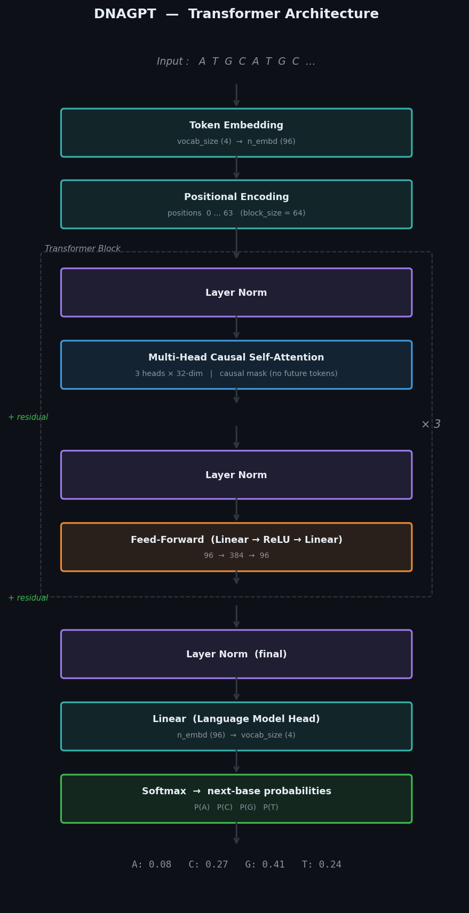
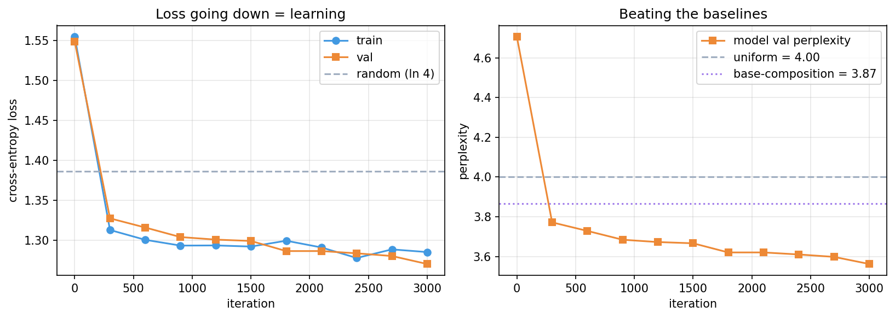
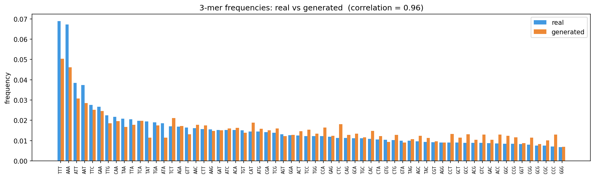

# Train a Small DNA Language Model — Beginner Tutorial


I think this technology is fascinating. I want to explore modeling biological sequences with the recent novel architectures. I felt like I need to start small here. I put this together in a tutorial format to help me easily retrace some concepts when I need to. I'd be glad to get some feedback or help on some helpful resources to keep exploring.

A hands-on tutorial for training a DNA language model from scratch on **real genome data**. Built for people new to machine learning: every concept is explained (i hope :)) the first time it appears.


## Summary

### Transformer Architecture
The full DNAGPT stack: embeddings → N× transformer blocks (causal self-attention + feed-forward) → language model head.



### Training — Loss & Perplexity Curves
Loss and perplexity dropping below both baselines across 3 000 training iterations.



### Evaluation — Real vs Generated 3-mer Frequencies
Side-by-side 3-mer frequency comparison between real genome sequence and model-generated DNA (correlation ≈ 0.96).



## What's inside so far

| File | What it is | 
|------|-----------|
| `dna_language_model_tutorial.ipynb` | The main event. A runnable notebook that downloads real genomes, builds a Transformer from scratch in PyTorch, trains it, evaluates it, and generates new DNA. Explanations interleaved with code. |
| `NOTES.md` | Plain-language companion: concept deep-dives + a full glossary. Read alongside the notebook or on its own. |
| `diagrams/` | The figures used throughout (pipeline, tokenization, attention mask, Transformer block, plus real result plots). |

(of course, I will update this as the project grows)

## What you'll actually do

1. Download two **real** genomes (human mitochondrial genome; a *C. elegans* fragment) — no login, works anywhere.
2. Explore them (base composition, GC content).
3. Tokenize DNA into numbers (character-level).
4. Build a **Transformer** from scratch — attention, causal masking, blocks — ~50 readable lines.
5. Train it and watch loss/perplexity fall below sensible baselines.
6. Generate new DNA and verify it reproduces real sequence structure.
7. Learn how to scale up to real research models (DNABERT, Nucleotide Transformer, HyenaDNA, Evo).

## Requirements

- Python 3.9+
- `pip install torch matplotlib requests`
- **No GPU required.** Defaults train in ~2–3 minutes on a plain CPU. A GPU (e.g. free Google Colab) lets you scale up.

## How to run

**Google Colab (easiest):** upload the notebook → `Runtime → Run all`. For a GPU: `Runtime → Change runtime type → T4 GPU` (optional).

**Locally:**
```bash
pip install torch matplotlib requests jupyter
jupyter notebook dna_language_model_tutorial.ipynb
```
Then run cells top to bottom.

## Expected result

Validation **perplexity** drops from ~4.9 to about **3.7**, beating both the uniform baseline (4.0) and the base-composition baseline (~3.87) — demonstrating the model learned real dependencies between bases, not just letter frequencies. Generated DNA reproduces real 3-mer frequencies with correlation ~0.7–0.8.

## A note on the data

The genomes are pulled from public FASTA files on GitHub so the tutorial is fully reproducible with no account or download portal. The final notebook section shows how to swap in larger genomes (e.g. *E. coli* from Ensembl) when you want more data.
